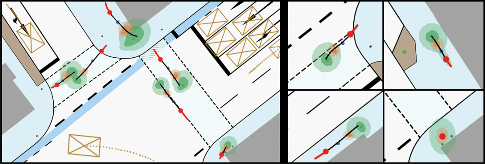
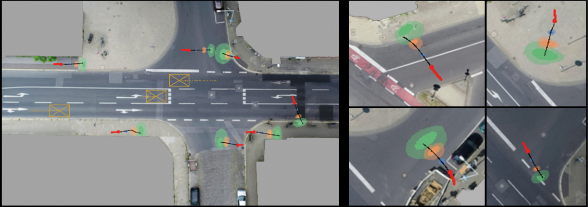

### Reliable Probabilistic Human Trajectory Forecasts for Autonomous Applications



#### Paper:
**..., "Reliable Probabilistic Human Trajectory Forecasts for Autonomous Applications", ...**

**Links:**
<!-- - IEEE Explore: [[click here]]()
 - ResearchGate: [[click here]]()
 - ArXiv: [[click here]]()
-->

#### Citation:
If you use our code/method, please cite:
```
@INPROCEEDINGS{,
  author={},
  booktitle={}, 
  title={Reliable Probabilistic Human Trajectory Forecasts for Autonomous Applications}, 
  year={2024},
  volume={},
  number={},
  pages={},
  doi={}
}
```


---
### Table of contents:
* [Overview](#overview)
* [Requirements](#requirements)
* [Datasets](#datasets)
* [Pretrained Models](#pretrained)
* [Data Preprocessing](#prepro)
* [Training](#training)
* [Evaluation](#evaluation)
* [License](#license)

---
<a name="overview"></a>
### Overview
This repository contains all information for the Paper: "Reliable Probabilistic Human Trajectory Forecasts for Autonomous Applications". We provide all scripts, data and background information to reproduce our results.


---
<a name="requirements"></a>
### Requirements

We used the following system config for our method:

```
# Hardware
AMD Ryzen 5900X
Nvidia RTX 4090

# Software
Ubuntu 22.04 LTS
Python 3.10
Pytorch 2.1.0
CUDA 12
CuDNN 8.9
```

The exact python requirements can be found in the corresponding requirements.txt file.

**Docker:**
If you want to use docker, we recommend the Nvidia NGC Pytorch 23.08 image, as we did: [[Info]](https://docs.nvidia.com/deeplearning/frameworks/pytorch-release-notes/rel-23-08.html) [[Docker Image]](https://catalog.ngc.nvidia.com/orgs/nvidia/containers/pytorch). Run the image and install the the corresponding python requirements.txt and your ready to go.


---
<a name="datasets"></a>
### Datasets
We use six popular road traffic datasets for our methods evaluation. For all datasets we extracted the raw pedestrians trajectories, applied a human-centric ego-coordinate system transformation, and subsampled the input- and output horizon data for training and evaluation. Additional information for all datasets can be found here:

**IMPTC:** [[Info]](https://ieeexplore.ieee.org/document/10186776) [[Get raw data]](https://github.com/kav-institute/imptc-dataset)


**inD:** [[Info]](https://ieeexplore.ieee.org/document/9304839) [[Get raw data]](https://github.com/ika-rwth-aachen/drone-dataset-tools)


**Waymo:** [[Info]](https://arxiv.org/abs/1912.04838) [[Get raw data]](https://waymo.com/intl/en_us/open/download/)


**nuScenes:** [[Info]](https://arxiv.org/abs/1903.11027) [[Get raw data]](https://github.com/nutonomy/nuscenes-devkit#nuscenes-setup)


**SDD:** [[Info]](https://cvgl.stanford.edu/projects/uav_data/) [[Get raw data]](https://www.kaggle.com/datasets/aryashah2k/stanford-drone-dataset)


**ETH/UCY:** [[Info]](https://ieeexplore.ieee.org/document/5459260) [[Get raw data]](https://github.com/StanfordASL/Trajectron-plus-plus/tree/master/experiments/pedestrians/raw/raw/all_data)


---
<a name="pretrained"></a>
### Pretrained Models and Datasets
Our pretrained models and pre-processed datasets can be found here for download.

| Dataset | Download Model | Download Data | Status    |
|:-------:|:--------------:|:-------------:|:---------:|
| ETH     | tba            | tba           | $${\color{gray}na}$$ |
| IMPTC   | tba            | tba           | $${\color{gray}na}$$ |
| inD     | tba            | tba           | $${\color{gray}na}$$ |
| nuScenes | tba           | tba           | $${\color{gray}na}$$ |
| SDD     | tba            | tba           | $${\color{gray}na}$$ |
| Waymo   | tba            | tba           | $${\color{gray}na}$$ |


---
<a name="prepro"></a>
### Data Preprocessing

tbd


---
<a name="training"></a>
### Model Training
To run a training you can use the following command. For every dataset type one can create as many configs as desired.
```
# Start a training using IMPTC dataset and default config
train.py --target=imptc --configs=default_peds_imptc.json --gpu=0 --log --print

# Arguments:
--target: target dataset
--configs: target dataset specific config
--gpu: gpu id to be used for the training
--log: write training progress and feedback to log file
--print: show training progress and feedback in console
```


---
<a name="evaluation"></a>
### Model Evaluation
To run a model evaluation you can use the following command. The evaluation shares the config file with the training script.
```
# Start an evaluation for an IMPTC dataset trained model
testing.py --target=imptc --configs=default_peds_imptc.json --gpu=0 --log --print

# Arguments:
--target: target dataset
--configs: target dataset specific config
--gpu: gpu id to be used for the evaluation
--log: write evaluation results to log file
--print: show evaluation results in console
```


---
<a name="license"></a>
## License:
This project is licensed under the Apache 2.0 License - see the [LICENSE](LICENSE) file for details
 
---
